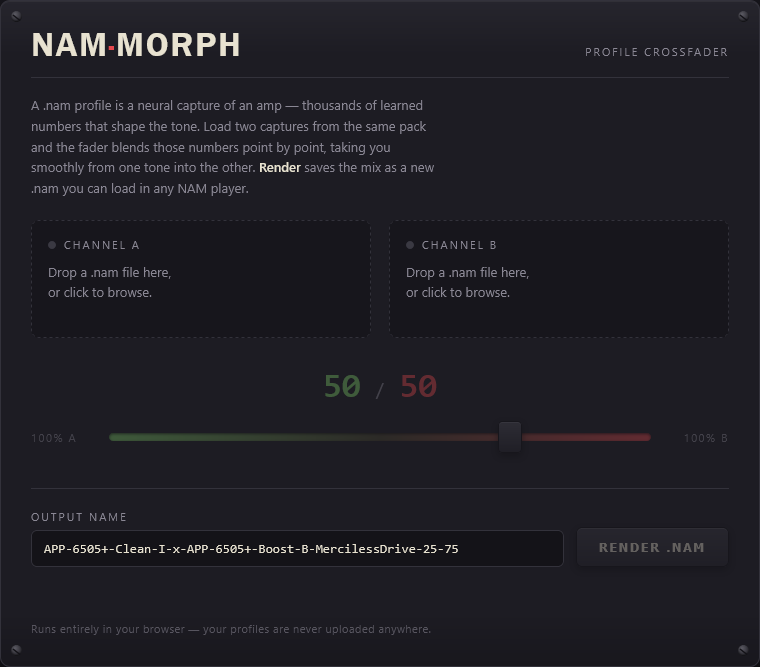

# NAM Morph

A profile crossfader for [Neural Amp Modeler](https://www.neuralampmodeler.com/) captures.
Load two `.nam` profiles, set the blend with a fader, and render a new profile that sounds
in between — a 50/50 of a clean and a crunch capture, a British/American hybrid, whatever
you can dream up.



## Why it works

A `.nam` file is a JSON snapshot of a small WaveNet neural network: an architecture
description plus a flat list of learned weights. Two captures made with the same trainer
settings share the exact same architecture, so their weight vectors live in the same
space. NAM Morph blends them by **linear interpolation of the parameters**:

```
new_weight[k] = A[k] + (B[k] − A[k]) × mix
```

It also blends the learned `head_scale` output level and the loudness/gain metadata, and
it supports both plain WaveNet files (official NAM trainer) and `SlimmableContainer`
files (TONE3000), including all their submodels.

Profiles with different architectures — different trainers, or different quality tiers —
can't be meaningfully blended; the tool detects this and explains the mismatch instead
of producing a broken file.

## Usage

It's a single self-contained HTML file. No install, no dependencies, no build.

- **Locally:** download `nam-morph.html` and double-click it.
- **Hosted:** drop the file on any static host.

Everything runs client-side in the browser — profiles are never uploaded anywhere.

1. Drop a `.nam` file on **Channel A** and another on **Channel B**.
2. Set the blend with the crossfader (starts at 50/50).
3. Adjust the output name if you like, then hit **Render .nam**.
4. Load the downloaded file in any NAM player.

## A note on expectations

Neural networks aren't linear systems, so a 50% blend in parameter space isn't
mathematically guaranteed to be a 50% blend in sound. In practice, between captures that
share an architecture — especially captures of the same or similar amps — the fader
moves the tone smoothly and lands convincingly in between.

## Development

The blending logic lives in a small UI-independent core (`window.morphCore`) inside
`nam-morph.html`. The test suite extracts that core verbatim and runs it against two
real profiles you provide:

```
node test/morph.test.js path/to/A.nam path/to/B.nam
```

It verifies compatibility detection, exact midpoint interpolation, asymmetric blends,
endpoint identity (0% and 100% reproduce the originals bit-for-bit), metadata blending,
and JSON round-tripping.
